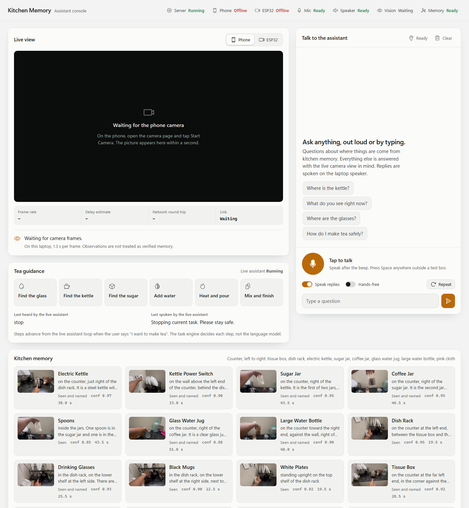
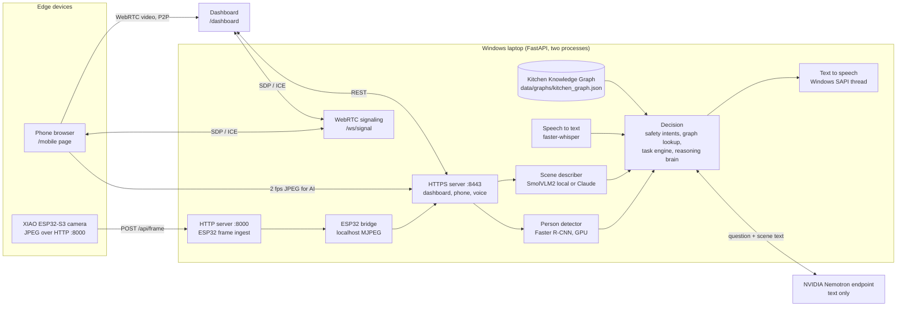
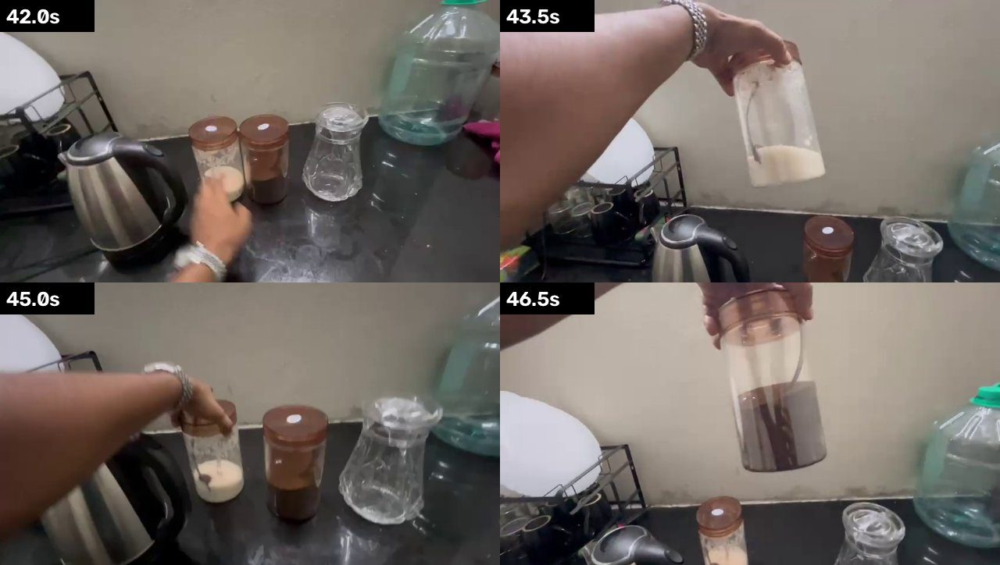

# Kitchen Memory

**A voice-first kitchen assistant for a visually impaired person.** It learns a kitchen from one narrated walkthrough video, stores what it saw as a spatial Kitchen Knowledge Graph, watches the room through live cameras, and answers out loud: *"Where is the sugar?"* → *"The sugar jar is on the counter, right of the kettle. It is the first of two jars, clear with a brown lid, with a spoon inside."*

Built at the TinkerSpace hackathon. Runs on one Windows laptop, one phone and one XIAO ESP32-S3 camera.



---

## Contents

- [What it does](#what-it-does)
- [Architecture](#architecture)
- [AI stack: local models and remote endpoints](#ai-stack-local-models-and-remote-endpoints)
- [Privacy: what leaves the laptop](#privacy-what-leaves-the-laptop)
- [How the kitchen memory was built](#how-the-kitchen-memory-was-built)
- [Low-latency video path](#low-latency-video-path)
- [Tech stack](#tech-stack)
- [Repository layout](#repository-layout)
- [Getting started](#getting-started)
- [Configuration](#configuration)
- [API reference](#api-reference)
- [Safety](#safety)
- [Roadmap](#roadmap)

---

## What it does

```text
TEACH  ->  UNDERSTAND  ->  MEMORIZE  ->  QUERY  ->  GUIDE
```

1. **Teach.** A sighted helper records one narrated walkthrough of the kitchen on a phone.
2. **Understand.** Frames and narration are analysed: what each object is, where it sits, what it sits next to.
3. **Memorize.** Everything is stored in a JSON Kitchen Knowledge Graph with confidence, evidence frame and evidence type for every fact.
4. **Query.** The user asks by voice. Location questions are answered from memory; anything else goes to a reasoning model that also sees the live camera description.
5. **Guide.** Replies are spoken through the laptop speaker. A deterministic task engine walks through a simple drink-preparation routine.

**Highlights**

| | |
|---|---|
| Greets by name | The kitchen camera detects a person entering and starts listening. Saying *"Hey, I am at the kitchen"* gets *"Hey Leela, welcome to the kitchen. How can I help you today?"* |
| Talk, do not tap | Tap-to-talk, Space bar, or hands-free continuous conversation. Safety words (*stop*, *repeat*) never go through an LLM. |
| Honest memory | Every object is marked *seen and named*, *seen*, *uncertain* or *unknown*. Unknown items produce the safe fallback *"I am not certain. Please stop."* |
| Real-time video | Phone camera to dashboard over WebRTC peer-to-peer: 30 fps, roughly 100 to 300 ms on a home network. |
| Two cameras | Phone (handheld or mounted, any orientation, auto-upright) and XIAO ESP32-S3 (fixed kitchen view). |

---

## Architecture

The system keeps four layers strictly separate so a language model can never directly move the task forward:

```text
PERCEPTION  ->  MEMORY  ->  DECISION  ->  OUTPUT
cameras, mic    graph       rules +       laptop
detectors, VLM  JSON        task engine   speaker
```



**Why two server processes?** The ESP32 firmware posts plain HTTP to `:8000`. Phones only grant camera access on HTTPS, so the phone page and dashboard live on `:8443`. The HTTPS process mirrors ESP32 frames from `:8000` over localhost, so every feature sees both cameras.

**Answer authority order** (in `server/app.py`, `answer_question`):

1. Arrival phrases (*"I am at the kitchen"*) give the personal greeting.
2. Safety intents (*stop*, *repeat*) are answered instantly and deterministically.
3. Location questions are answered from the Kitchen Knowledge Graph.
4. Everything else goes to the reasoning brain, with kitchen facts and the latest scene description as context.

---

## AI stack: local models and remote endpoints

| Role | Model | Runs | Where in code |
|---|---|---|---|
| Person detection (entry trigger) | torchvision **Faster R-CNN MobileNetV3-FPN** (COCO) | **Local**, CUDA, about 50 to 90 ms per frame | `server/presence.py` |
| Speech to text | **faster-whisper** `small.en` with energy VAD | **Local**, CUDA or CPU | `scripts/audio_io.py` |
| Text to speech | **Windows SAPI** on a dedicated COM thread | **Local** | `server/tts_worker.py` |
| Live scene description | **SmolVLM2-500M-Video-Instruct** | **Local**, CUDA | `scripts/live_kitchen_vlm.py --backend local` |
| Live scene description (optional) | **Anthropic Claude** vision | **Endpoint** (opt-in) | `scripts/live_kitchen_vlm.py --backend claude` |
| Reasoning brain | **NVIDIA Nemotron** via OpenAI-compatible API | **Endpoint** | `scripts/brain.py` |
| Kitchen memory authoring | **Claude vision** review of 52 walkthrough frames + whisper narration | One-time, offline authoring step | `scripts/build_graph_claude_vision.py` |
| Task engine | Deterministic state machine | **Local**, no model | `scripts/live_kitchen_assistant.py` |

**How the endpoints connect**

- **NVIDIA Nemotron** (`NVIDIA_BASE_URL`, default `https://integrate.api.nvidia.com/v1`) is called with the OpenAI Python SDK. It receives only text: the user's question, a short list of kitchen facts, and the latest one-sentence scene description. Camera frames are never sent. If the key is missing or the endpoint is down, location answers still work from the local graph.
- **Anthropic Claude** is used only if `VLM_BACKEND=claude` and `ANTHROPIC_API_KEY` are set. If the key, SDK or network is unavailable, the scene describer falls back to local SmolVLM2 automatically.
- Everything else (detection, speech in, speech out, memory, decisions, video transport) runs on the laptop.

---

## Privacy: what leaves the laptop

| Data | Leaves the laptop? |
|---|---|
| Phone video | No. WebRTC goes phone to laptop browser directly over the LAN. |
| ESP32 frames | No. |
| Microphone audio | No. Transcribed locally. |
| Kitchen memory | No. |
| Question text + kitchen facts + scene sentence | Yes, to NVIDIA Nemotron, only when a question is not answerable from memory. |
| Camera frames | Only if you opt in to `VLM_BACKEND=claude`. Default local mode keeps them on the laptop. |

---

## How the kitchen memory was built

The first graph came from automatic keyframes and narration alone, and it was poor: locations like *"at the area shown around 27.84 seconds"*, the spoon marked unknown, and the speech recognizer hearing *"two bottles and a mug"* where the video shows two jars.

The current graph was rebuilt with a frame-by-frame **Claude vision** review:

1. 52 frames sampled every 1.5 s across the 78 s walkthrough, tiled into contact sheets (`artifacts/claude_vision/`).
2. Each object identified visually and cross-checked with the narration transcript (`artifacts/transcripts/`).
3. Locations written for speech, from one fixed point of view: *facing the counter, left end is the door corner*.
4. One evidence frame saved per object (`artifacts/kitchen_evidence/`), shown in the dashboard.



Result: 21 objects, a left-to-right counter order (*tissue box, dish rack, kettle, sugar jar, coffee jar, glass water jug, large water bottle, pink cloth*), relationships such as `RIGHT_OF`, `INSIDE` and `NEXT_TO`, and the narrated coffee routine. Rebuild any time with:

```powershell
.venv\Scripts\python.exe scripts\build_graph_claude_vision.py
```

The walkthrough video itself is personal footage and is **not** in this repository. Place it in the project root to rebuild evidence frames.

---

## Low-latency video path

| Before | After |
|---|---|
| Canvas to JPEG (q 0.9) every 200 ms, 5 fps | Phone hardware H.264/VP8 encoder, 30 fps |
| WebSocket relay with synchronous disk writes | WebRTC peer-to-peer on the LAN; server only relays signaling |
| `` swap per frame on the dashboard | `<video>` element, browser-adaptive jitter buffer (`?jb=0` forces minimum) |
| AI and display shared one path | Display over WebRTC, AI gets separate 2 fps upright JPEGs |

The dashboard shows live stream stats (frame rate, round trip, jitter buffer, decode time, estimated delay). If WebRTC cannot connect, it falls back to the JPEG socket automatically. A phone held sideways with auto-rotate locked is detected through the motion sensor and turned upright on the dashboard.

---

## Tech stack

| Layer | Technology |
|---|---|
| Server | Python 3.11, FastAPI, Uvicorn (HTTP + HTTPS), WebSockets |
| Video | WebRTC (browser native), MJPEG, OpenCV |
| AI | PyTorch 2.6 + CUDA, torchvision, Transformers (SmolVLM2), faster-whisper, OpenAI SDK (Nemotron), Anthropic SDK (optional) |
| Audio | sounddevice / PortAudio, Windows SAPI via pywin32 |
| Frontend | Vanilla HTML/CSS/JS, Phosphor icons (vendored), no build step |
| Firmware | PlatformIO, Arduino framework, Seeed XIAO ESP32-S3 Sense, `esp_camera` |
| Memory | JSON Kitchen Knowledge Graph |
| Pitch | Blender 4.5 Python scripts for the wearable camera clip model |

---

## Repository layout

```text
server/            FastAPI app, WebRTC signaling, ESP32 bridge, voice, TTS worker, person detector
dashboard/         Assistant console (single page, no build)
mobile/            Phone camera page (WebRTC publisher + AI frame sender)
scripts/           Graph builders, live VLM worker, voice assistant loop, audio I/O, brain, utilities
firmware/          XIAO ESP32-S3 camera node (PlatformIO)
data/graphs/       Kitchen Knowledge Graph
artifacts/         Curated outputs: evidence frames, keyframes, vision contact sheets, transcript
docs/              Problem statement, architecture, AI stack, firmware, API, testing, roadmap
pitch/             Hardware photos, Blender model and video scripts, pitch preview
```

---

## Getting started

**Requirements:** Windows 10/11, Python 3.11, an NVIDIA GPU (optional but recommended), Git for Windows (provides `openssl`), a phone on the same Wi-Fi, and optionally a Seeed XIAO ESP32-S3 Sense.

```powershell
git clone https://github.com/NijoP/hackthon-tinkerspace.git
cd hackthon-tinkerspace

python -m venv .venv
.venv\Scripts\python.exe -m pip install -r requirements.txt

copy .env.example .env          # then add NVIDIA_API_KEY (and optionally ANTHROPIC_API_KEY)
.venv\Scripts\python.exe scripts\make_certs.py     # HTTPS certificate for your LAN IP

.venv\Scripts\python.exe scripts\launch_servers.py # starts :8000 (HTTP) and :8443 (HTTPS)
```

Then:

| Device | Open |
|---|---|
| Laptop | `https://<laptop-ip>:8443/dashboard/` (accept the certificate warning once) |
| Phone | `https://<laptop-ip>:8443/mobile/` and tap **Start Camera** |

**Optional workers**

```powershell
# Live scene description (local SmolVLM2, frames stay on the laptop)
.venv\Scripts\python.exe scripts\live_kitchen_vlm.py --backend local --source mobile

# Standalone voice loop with the tea task engine (do not run alongside dashboard voice; they share the mic)
.venv\Scripts\python.exe scripts\live_kitchen_assistant.py
```

**ESP32 camera**

```powershell
copy firmware\include\secrets.h.example firmware\include\secrets.h   # Wi-Fi + laptop IP
cd firmware
pio run -t upload
```

The board posts VGA JPEG frames to `http://<laptop-ip>:8000/api/frame`. They appear under **ESP32** on the dashboard.

---

## Configuration

All settings live in `.env` (see [`.env.example`](.env.example)).

| Variable | Purpose |
|---|---|
| `NVIDIA_API_KEY`, `NVIDIA_BASE_URL`, `NVIDIA_MODEL` | Reasoning brain endpoint |
| `VLM_BACKEND` (`local` / `claude`), `ANTHROPIC_API_KEY`, `VLM_CLAUDE_MODEL` | Scene describer |
| `USER_NAME` | Name used in the greeting (default `Leela`) |
| `PRESENCE_ENABLED`, `PRESENCE_AUTO_LISTEN` | Person detection and listen-on-entry |
| `PRESENCE_GREET_COOLDOWN_S`, `PRESENCE_ABSENT_RESET_S` | Greeting debounce |
| `WHISPER_MODEL` | faster-whisper model (default `small.en`) |
| `TTS_RATE`, `TTS_VOLUME`, `TTS_VOICE` | Laptop voice |

---

## API reference

| Method | Path | Purpose |
|---|---|---|
| GET | `/status`, `/health` | System health, camera freshness, LAN IP |
| POST | `/api/frame` | ESP32 JPEG upload |
| GET | `/api/latest.jpg`, `/api/stream` | ESP32 latest frame, MJPEG stream |
| WS | `/ws/signal` | WebRTC signaling (phone publisher, dashboard viewers) |
| WS | `/ws/mobile` | Phone AI frames (2 fps) and JPEG fallback relay |
| GET | `/api/mobile/latest.jpg` | Latest phone frame |
| POST | `/api/assistant/ask` | Typed question, optional spoken reply |
| POST | `/api/voice/turn` | Beep, listen, transcribe, answer, speak |
| POST | `/api/voice/speak`, `/api/voice/clear` | Speak text, forget conversation |
| GET | `/api/voice/state` | Speaking state and camera-triggered conversation events |
| GET / POST | `/api/presence`, `/api/presence/config` | Person detection status, listen-on-entry toggle |
| GET | `/api/graph`, POST `/api/query` | Kitchen memory, deterministic location answer |
| GET | `/api/vlm/state`, `/api/assistant/state` | Scene describer and task engine state |
| GET / POST | `/api/audio/*` | Device list, speaker test, mic test, warm-up |

---

## Safety

This is a hackathon prototype, **not a certified assistive device**. For blindfolded demonstrations, do not use boiling water or hazardous appliances, keep a sighted person present, and use a controlled or simulated routine. Whenever memory or perception is uncertain, the assistant says *"I am not certain. Please stop."*

---

## Roadmap

- Haptic cues on the wearable clip
- On-device keyword spotting so the greeting works without the camera trigger
- Multi-room memory and automatic graph updates from live observations
- Fully local reasoning model as a drop-in for the Nemotron endpoint

See [`docs/15-future-roadmap.md`](docs/15-future-roadmap.md) and the live [`docs/roadmap.html`](docs/roadmap.html).

---

## Acknowledgements

Phosphor Icons (MIT), Hugging Face SmolVLM2, faster-whisper, torchvision detection models, NVIDIA Nemotron, Anthropic Claude, Seeed Studio XIAO ESP32-S3.
